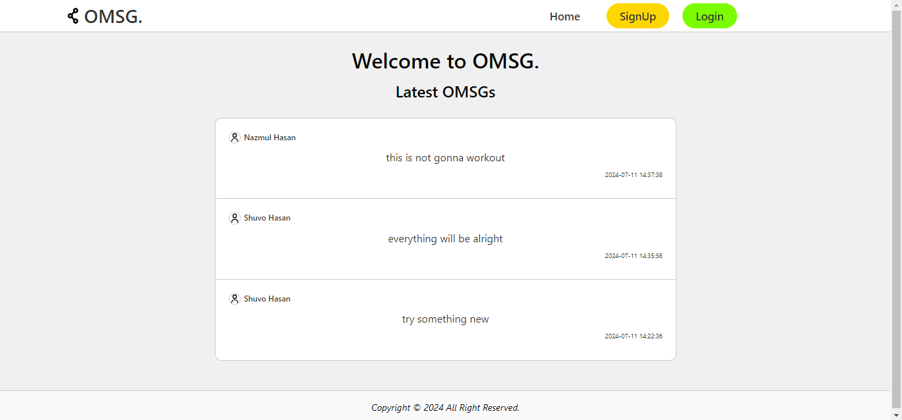
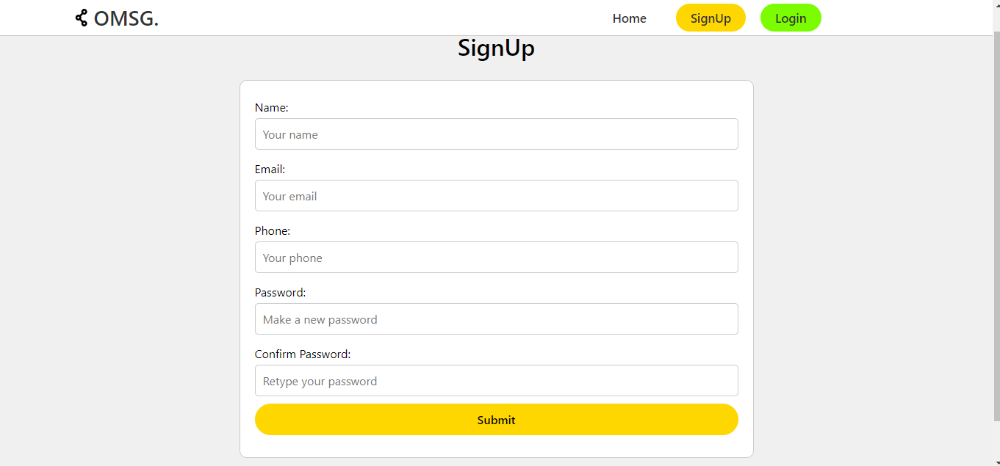
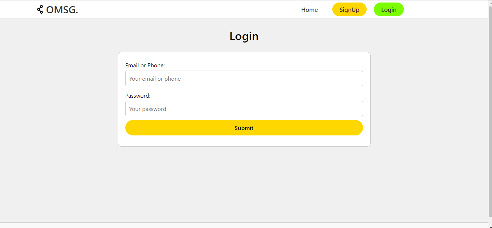
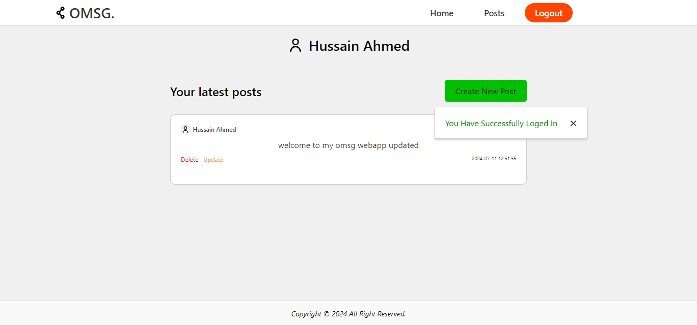
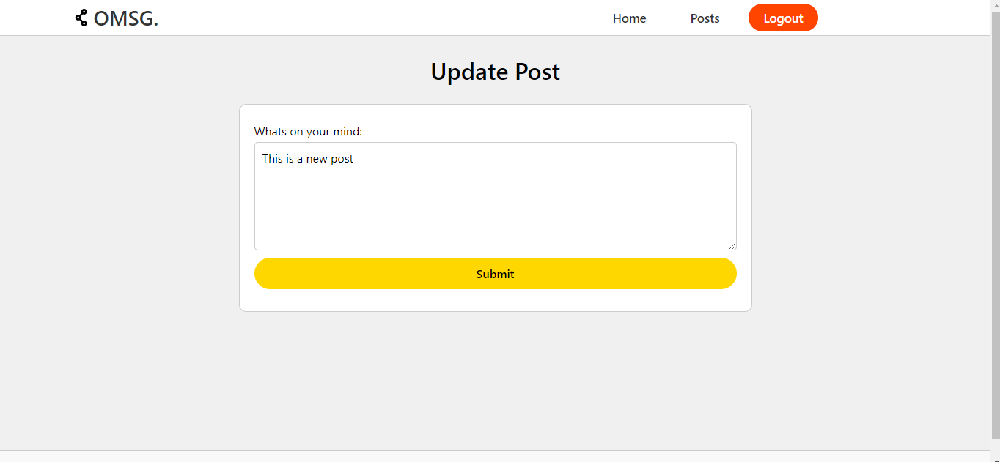
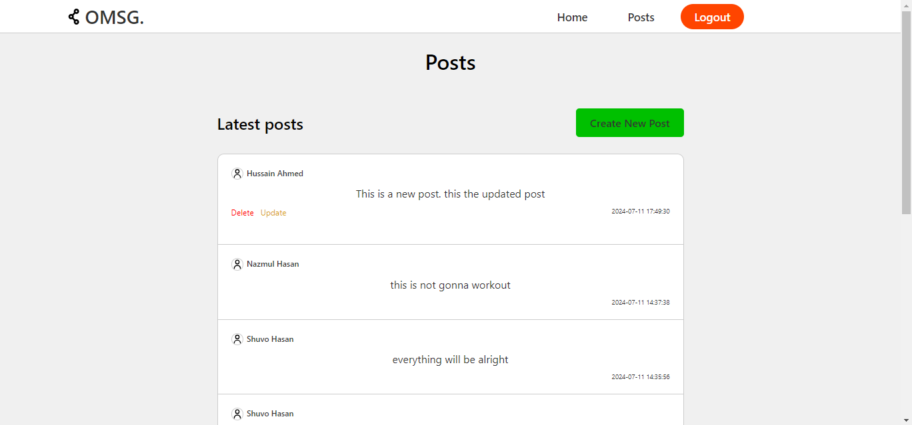
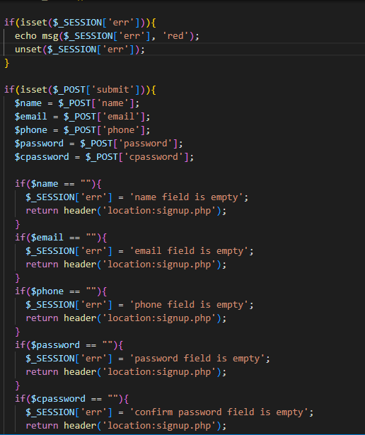
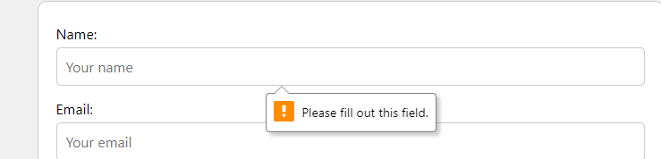
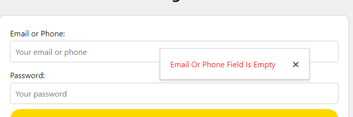
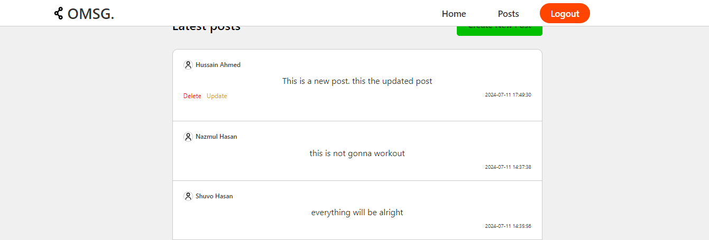

Hello👋, this is a simple project where people can create an account and post messages.

folders--
smsg/ -- on the root directory where the all .php file and pages are held. 
smsg/assets/ -- where the static files like images, logo, css are held.
smsg/database/ -- where the date base .sql file is held.
smsg/project_images/ -- where all of my projects screenshots are held.

-- Index/Home page when you are not logged in

-- SignUp/Register page

-- Login page

-- User home page

-- Create post page

-- Update post page

-- All users posts

well this is minimal project to showcase my basic skill in php.
this projects has server side user authentication as client side.

users have ability to update and delete there post from home and also all users post page.

Thank 💙 you for chacking out my project.

